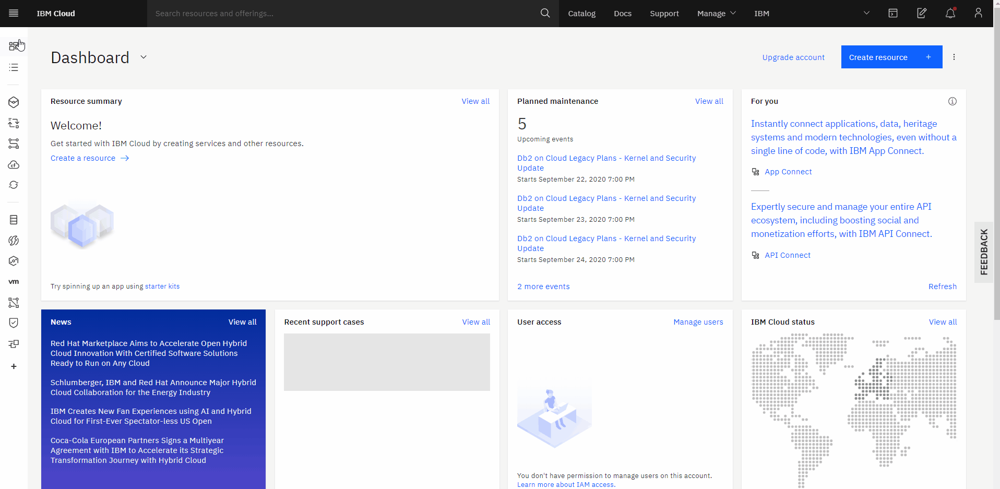
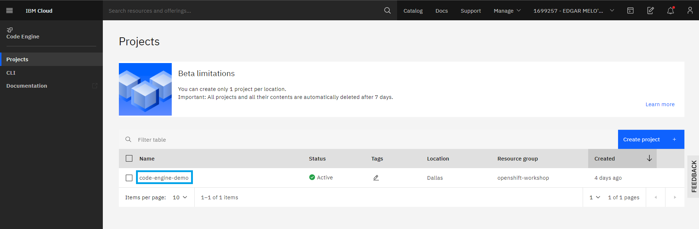
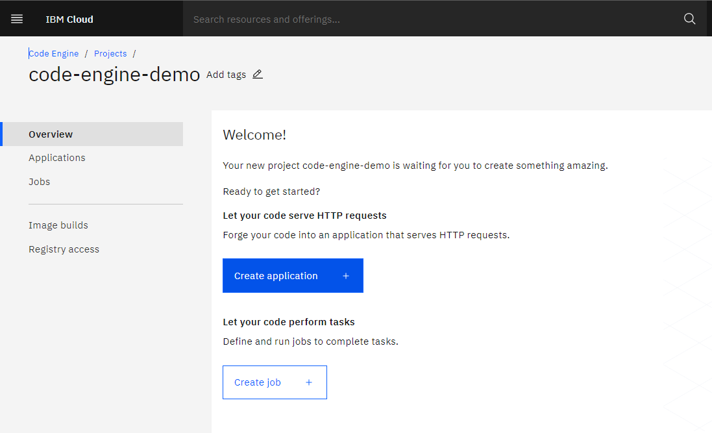
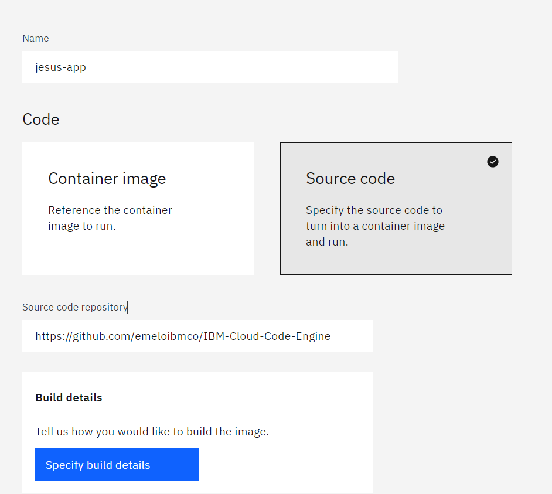
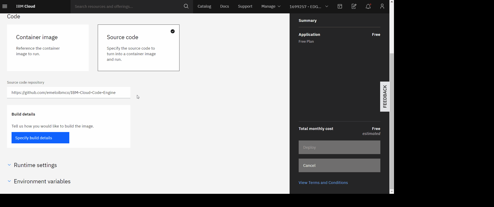
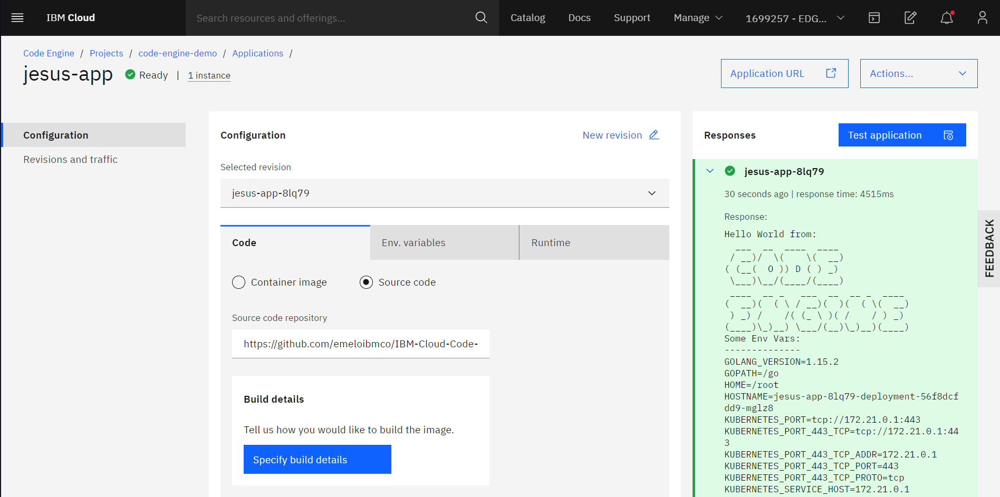

# <h1 align=center> Hands On IBM Cloud Engine

**Aclaración**: A la fecha, 21 de Septiembre del 2020, IBM Cloud Engine se encuentra en fase Beta.

Con IBM Cloud Engine podrá realizar despliegues de aplicaciones en segundos con un modelo totalmente Serverless.

IBM Cloud Engine permite realizar despliegue de aplicaciones a partir de una imagen [Docker](https://www.docker.com/) :whale: o directamente del código fuente.

### 📑 Tabla de contenido

1. [Requisitos](#requisitos)
2. [Hands On!](#-hands-on)
3. [Recursos Adicionales](#recursos-adicionales)

### Requisitos

- Cuenta de [IBM Cloud](https://cloud.ibm.com) :cloud:

### :hand: Hands On!

1. En el menú hamburguesa, seleccionamos el servicio Code Engine.

2. Seleccionamos la pestaña Projects. Nos debe aparecer el proyecto code-engine-demo

3. En el proyecto code-engine-demo, presionamos el botón Create application.

4. **Parámetros**

- **Name**: Escribimos el nombre de nuestra app. _Recomendación_: \<su-nombre\>-app. Por ejemplo, jesus-app.

- **Code**: Seleccionamos la opción **Source Code**. Nos aparecerá un cuadro de texto en el que debemos pegar el enlace al repositorio GitHub: https://github.com/emeloibmco/IBM-Cloud-Code-Engine

5.**Configurar el acceso a registro**: del proyecto. Para esto se debe generar un apikey en el panel de acceso IAM que tenga permisos para acceder y editar el container registry.
  
  Luego en el proyecto de code engine en el panel de la izquierda selecciona la sección **acceso a registro** y en el boton crear se despliega un menú que debe   llenar asi:
  
-_Orden de registro: Seleccionar personalizado
-_Nombre de registro: Puede usar el nombre sugerido
-_Nombre de usuario: iamapikey
-_Servidor de registro: En nuestro caso el servidor de us-south es us.icr.io. Usar el servidor de su region.
-_Contraseña: Ingrese la apikey que genero o una existente.
-_Correo electronico: El correo de su cuenta IBM cloud.

  Finalmente dar click en el botón crear.
  
  
6. **Build Details**: presionamos el botón Specify build details, lo que nos desplegará un panel en el costado derecho de la pantalla. Llenamos los campos de acuerdo a la siguiente información:   
   **Pestaña Source**

- _Source repository_: Colocamos el enlace a nuestro repositorio GitHub
- _Branch name_: master
- _Context directory_: /helloworld   
  **Pestaña Strategy** 
  Dejamos los campos como están y presionamos next.   
  **Pestaña Output** 
  
- _Registry name_: code-engine-registry
- _Namespace_: Buscamos y seleccionamos de la lista, code-engine-ns.
- _Repository_: Buscamos y seleccionamos de la lista, hello-world-go.
- _Tag_: Dejamos el valor predeterminado, latest.

6. Finalmente, presionamos Deploy.

### Resultado

Tendremos el Dashboard de nuestra aplicación donde podremos cambiar la configuración de nuestra aplicación, generar una nueva versión, realizar una prueba a nuestro endpoint, entre otras funciones.

#### Endpoint

### Recursos Adicionales

- [IBM Cloud Code Engine](https://cloud.ibm.com/codeengine)
- Para preguntas o comentarios puede contactarnos por el Slack dedicado 
  [Register](https://cloud.ibm.com/kubernetes/slack) |
  [Login](https://ibm-cloud-success.slack.com/) y únete al canal
  [#code-engine](https://ibm-cloud-success.slack.com/archives/C014051FRCG)

### Autores

Equipo Cloud Tech Sales Colombia

IBM
